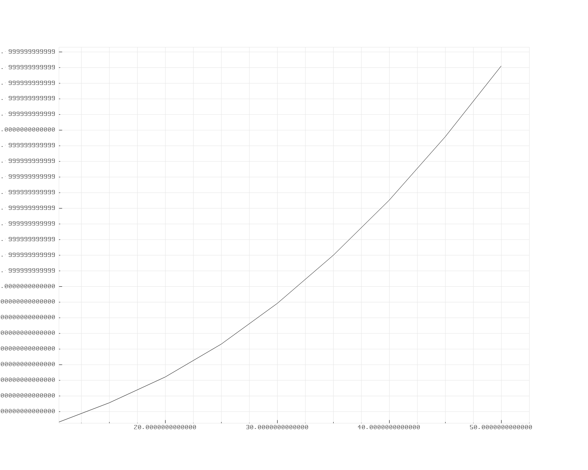
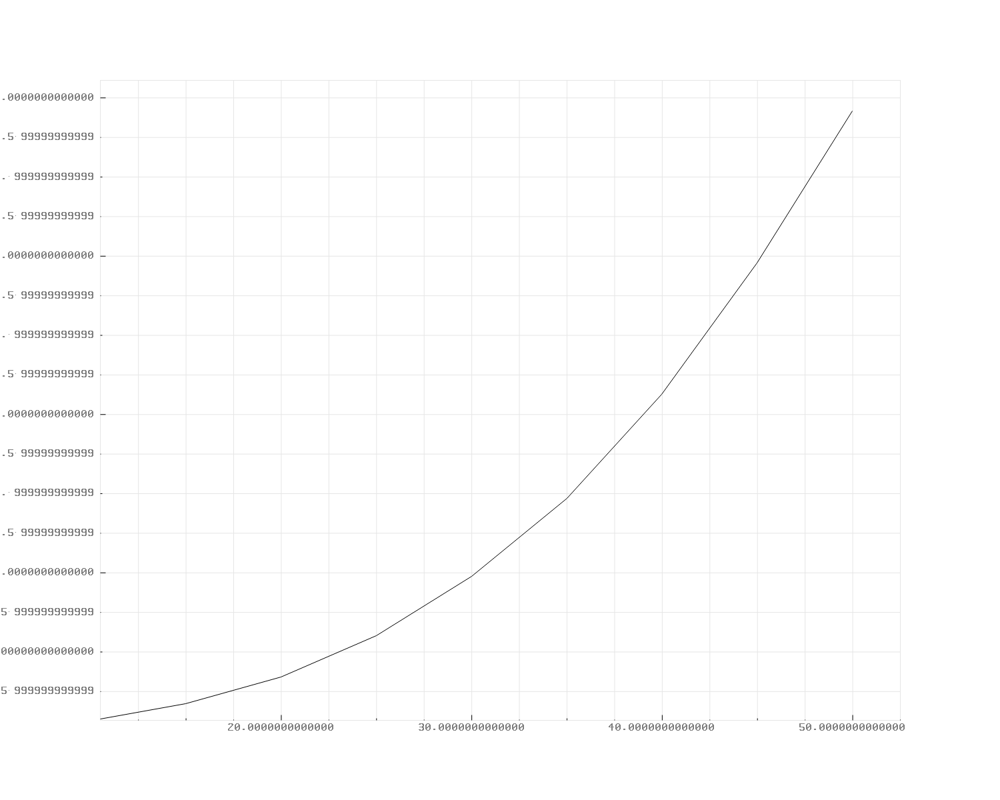
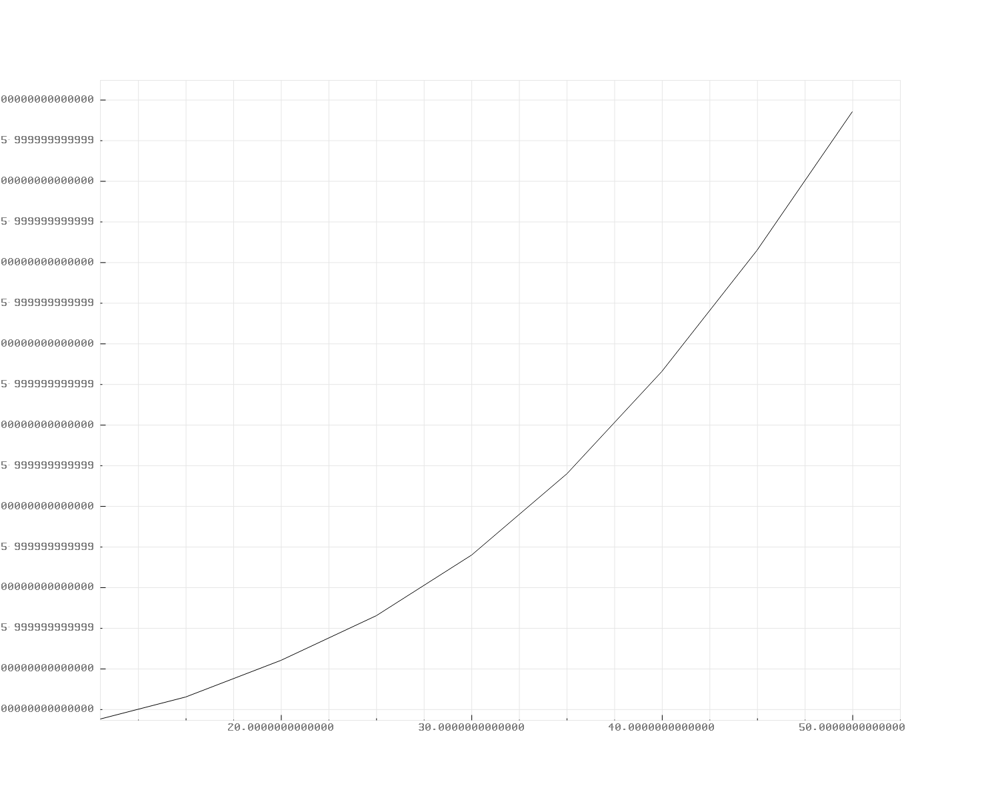
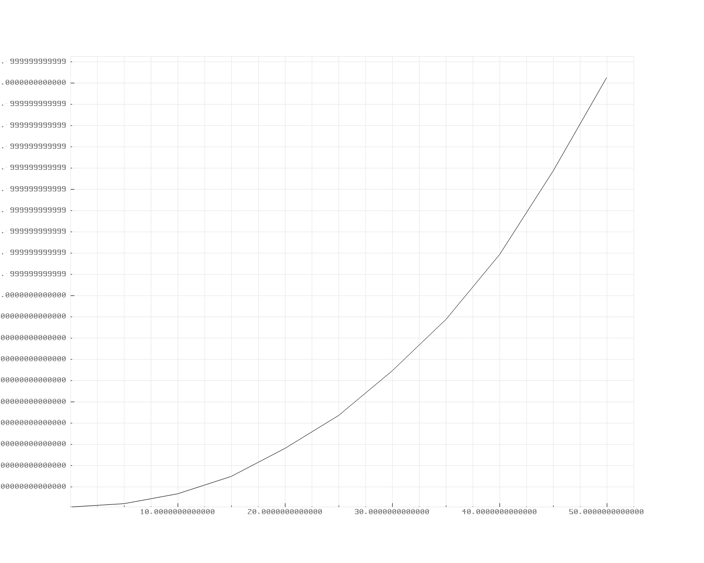

# Performance-Analysis-of-Sorting-Algorithms---Graphical-Representation

## Overview

This project implements various sorting algorithms in C and analyzes their performance based on different array sizes. The average execution time for each algorithm is calculated and visualized using the pbPlots library. 

## Sorting Algorithms
### Sorting Algorithms Comparison Table

| Algorithm       | Best Case      | Average Case   | Worst Case     | Memory    | Stable         | Method Used                 |
| --------------- | -------------- | -------------- | -------------- | --------  | -------------- | --------------------------- |
| Merge Sort      | O(n log n)     | O(n log n)     | O(n log n)     | O(n)      | Yes            | Divide and Conquer          |
| Bubble Sort     | O(n)           | O(n^2)         | O(n^2)         | O(1)      | Yes            | Swapping adjacent elements  |
| Selection Sort  | O(n^2)         | O(n^2)         | O(n^2)         | O(1)      | No             | Select and swap             |
| Insertion Sort  | O(n)           | O(n^2)         | O(n^2)         | O(1)      | Yes            | Build sorted sequence       |
| Heap Sort       | O(nlogn)       | O(nlogn)       | O(nlogn)       | O(1)      | No             | Partitioning                |

## Overview

### 1. Merge Sort

**Description:** Merge Sort is a divide-and-conquer algorithm that recursively divides the input array into halves, sorts each half, and then merges the sorted halves to produce a sorted array.

**Time Complexity:** O(n log n) for all cases (best, average, and worst).

**Space Complexity:** O(n) additional space for the merge process.

---

### 2. Bubble Sort

**Description:** Bubble Sort is a simple sorting algorithm that repeatedly steps through the list, compares adjacent elements, and swaps them if they are in the wrong order. The pass through the list is repeated until the list is sorted.

**Time Complexity:** O(n^2) for worst and average cases, O(n) for the best case (when the list is already sorted).

**Space Complexity:** O(1) as it doesn't require additional space.

---

### 3. Selection Sort

**Description:** Selection Sort is an in-place comparison sorting algorithm. It divides the input list into a sorted and an unsorted region. In each iteration, the smallest (or largest) element from the unsorted region is selected and swapped with the first element of the unsorted region.

**Time Complexity:** O(n^2) for all cases.

**Space Complexity:** O(1) as it doesn't require additional space.

---

### 4. Insertion Sort

**Description:** Insertion Sort is a simple sorting algorithm that builds the final sorted array one item at a time. It is much less efficient on large lists than more advanced algorithms such as quicksort, heapsort, or merge sort. However, it has advantages for small lists or lists that are mostly sorted.

**Time Complexity:** O(n^2) for worst and average cases, O(n) for the best case (when the list is almost sorted).

**Space Complexity:** O(1) as it doesn't require additional space.

## Project Structure

- **Algorithm**: Contains the code for sorting algorithms (bubblesort.h, insertionsort.h, mergesort.h, quicksort.h, selectionsort.h).
- **include**: Supporting files (generateRandomArray.h, pbPlots.h, etc.).
- **output**: Images of plotted graphs.
- **config.txt**: Configuration file storing variables like NumberofIterations, StartIterationFromSize, IterationGap, EndIterationTillSize, RandomArrayUpperBound, RandomArrayLowerBound.
- **main.c**: Main file to run the project.

## How to Run

bash
`gcc main.c ./include/pbPlots.c ./include/supportLib.c -o application
./application`

## Configuration

Adjust the parameters in [`config.txt`](https://github.com/21Sandesh/Performance-Analysis-of-Sorting-Algorithms---Graphical-Representation/blob/main/config.txt) to customize the project settings.

## Plotted Graphs

*MergeSort Plot*

*BubbleSort Plot*

*InsertionSort Plot*

*SelectionSort Plot*

## LICENSE

This Project is licensed under the [GNU General Public License v3.0](https://github.com/21Sandesh/Performance-Analysis-of-Sorting-Algorithms---Graphical-Representation/blob/main/LICENSE)
